# Product Definition and Pricing (PDP)

Here will see views by views the operation of this software.

## Views by views

### Lobby
When you open the software, you arrive on the page containing all the **models**.

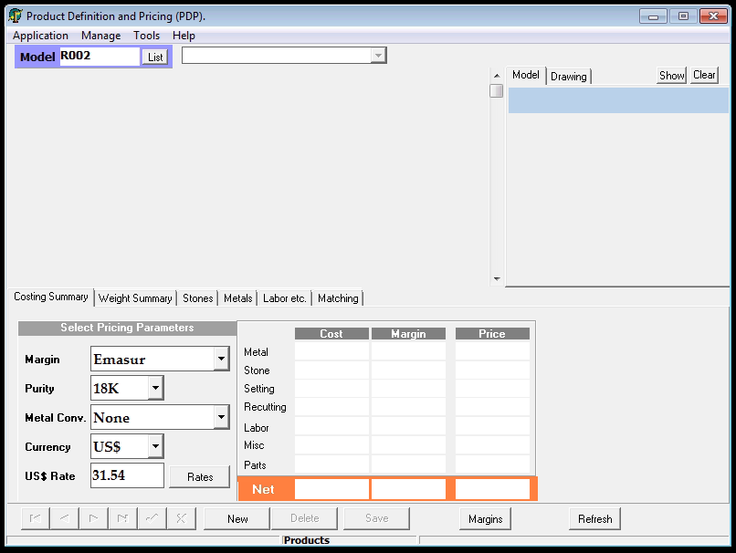

It contains a toolbar at the top with those options :
* Application
* Manage
* Tools
* Help

Just below you can display a view on a `Model` by selecting it and specify the `Design`.
It gives on a table the design that exist on this model.
On the right of this view there is a picture (if it exist) and the drawing of the `Model` selected.

In the low parts of the window, multiple table give information about the specs of the selected design, its price for exemple.

Finally you have at the top, a manager toolbar allow the creation and deletion of `Design` and a button `Margins`.

### Model Image

By default you have an **image** of the model on the upper right, or by clicking on `Model`.
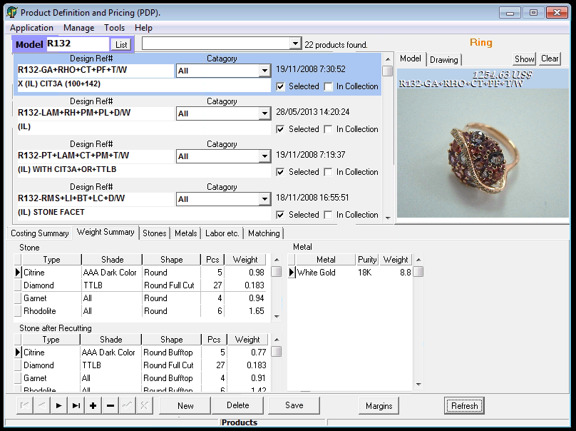

### Drawing

By clicking on `Drawing` on the upper right window, when it has been referenced, you can get its identification code.
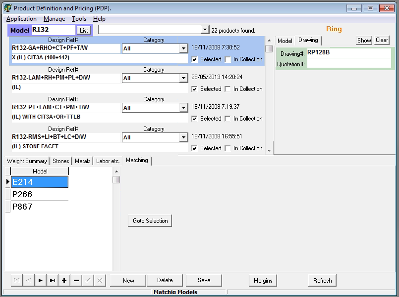

### Model List
By clicking on `List` next to `Model XXXX`, you will list all the existing models.

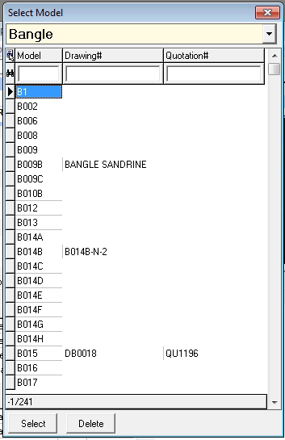

This view contains a table with those columns :
* Model
* Drawing#
* Quotation# 

### New Button
By clicking on `New` on the menue at the bottom of the page, you open `Make New Product` view.
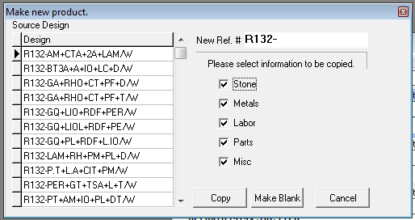

Here you can do two things :
* Creating a blank product by clicking on `Make Blank`
* Copying an other product by clicking on `Copy` 

When we want to create a new model, you may want to click on `Make Blank`.
When we want to create a product based on an an existing model, copy it by clicking on `Copy` and create the reference according to it.

### Model Fields
#### Product References

Here we go the model `R132`, products with differents colors have been made `Design Ref#`:
* R132-GA+RHO+CT+PF+T/W
* R132-PT+LAM+PM+PL+D/W
* R132-PT+LAM+CT+PM/T/W
* R132-RMS+LI+BT+LC+D/W

Those are on the format : `AAXXXB-CS+S1+S2+S3 + .. + SN/W`
With:
* `AAXXXB` : 
    * AA or A : The type (R: Ring, B: Bangle, BA: Bracelet, BR: Brooch, ...)
    * XXX: The chronological number of the model
    * B, C, .. or None : For model that are almost the same but cannot be differenciated with different references

* `CS+S1+S2+S3 + .. + SN/W` :
    * AAXXXB : Number of the model 
    * CS : The center stone (Or major stone)
    * Si : The other stones
    * W : For White Gold which is the **reference metal** (Withe Gold 18K)

### Costing Summary
By default you are on the `Costing Summary` Menue on the lower part of the page.
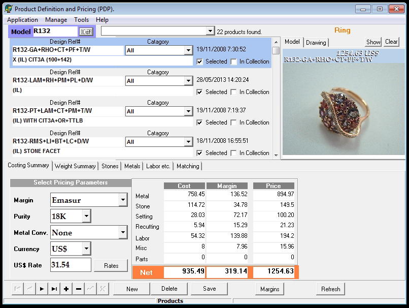

This is one of the most important table from `PDP` because all this is the pricing of the product that has been compute by the software.
It will compute it in function of the parameters that you indicate :
* `Margin` depending on the client
* `Purity` of the gold used
* `Metal Conv.` the metal used on the product. *Conv* come frome the fact that PDP used White Gold 18K as a reference and so we convert into the metal needed.
* `Currency` of the cost given
* `US$ Rate` with the button next to it `Rates` to open the page `Currencies` (see later on)

Then you got the details of the pricing in tree columns :
* `Cost` the cost that Rubicon have to pay
* `Margin` the margin for Rubicon 
* `Price` the sum of the two precedents, what the client needs to pay

#### Weight Summary
By clicking on `Weight Summary` you got tables on the details of the weigths

In the table `Stone` you have their weight before cutting and in `Stone after Recutting` well... you have the weight after Recutting.

In `Metal` the weight in the chosen metal.

#### Stones

By clicking on `Stones` the lower part have changed.
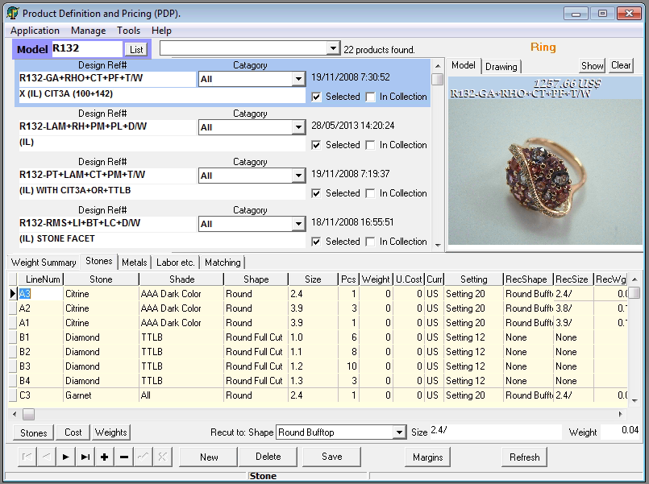

This is the list of the sones used. You can modify those lines according to the order here. But you can add only stones that are already registered in the database. 

Some fields deserves a few explanations: 

* `LineNum` : the key of the line, it have to be unique but there is currently no naming standards.

* `Setting` : record the labor costs of setting.

* `RecShape` : The shape in which the stone will be reshaped (if needed)
* `RecSize`, `RecWgt` : The recutting size and weight. This is with those fields than the recutting cost is compute.

If there is a reshaping, PDP will compute the cost of it. (We see later how)

#### Metals
By clicking on `Metals` the lower part have changed.
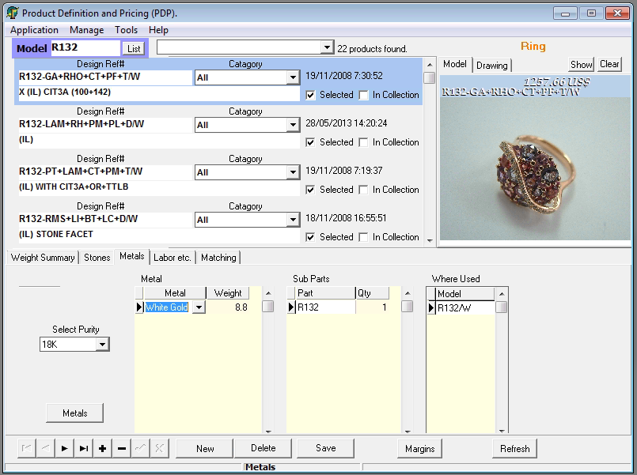

Here is listed the metals used, his quantity, quality, ... 
From here if you click on `Metals` we will go to `Metal Info.`. (See later on)

Here you can by clicking on `+`, `-` adding or removing the metals.

#### Labor etc.
By clicking on `Labor etc.` the lower part have changed.
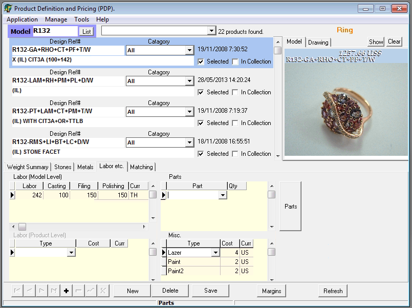

On the table `Labor (Model Lebel)`.

All the kind of labor costs are listed here. You can also added cost for engraving (`Lazer`) or painting (`Paint`).

By clicking on `Parts` you open the page `Parts` (supprisly). (See later on)

#### Matching

By clicking on `Matching` the lower part have changed.
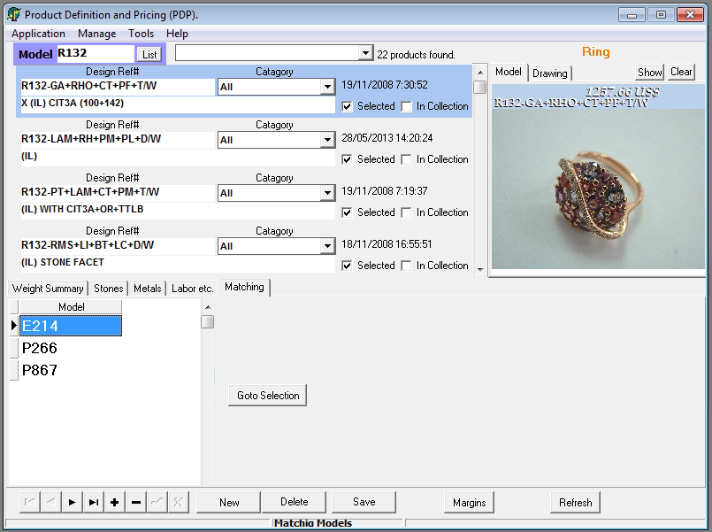

Show items that are matching the look of your product on display to find a set.
For example a ring that goes well with a pair of earring and a pendant.

### Manage Stones And Diamonds
On the toolbar, there is the `Manage` menu.
You can acces here `Stones And Diamonds`, then three choices appear.

#### Types, Shapes etc.
By clicking on `Types, Shapes etc.` you will arrive on the `Stone Info.` page.

##### Categories
By default you will arrive on the `Categories and Types.` view.

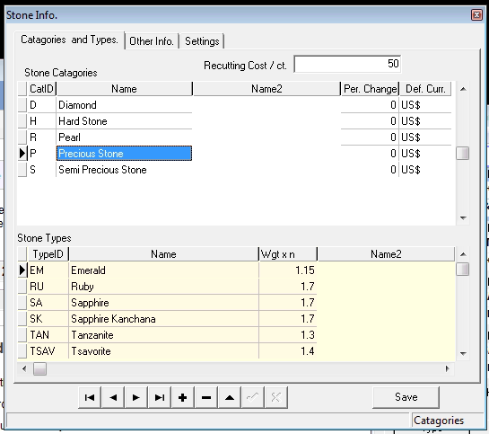

Here you can manage the database of `Type Stone`.

They are sorted by categories.

The table at the bottom depends of the category selected.
It display the `Type` of stones with the fields :
* `TypeID` (a unique field) 
* `Name` 
* `Wgt x n` (density in function of a reference)

Remarks : 
* `Wgt x n` will surely be changed 
* `Name2` will surely be removed

##### Details
By clicking on `Other Info.` you got :
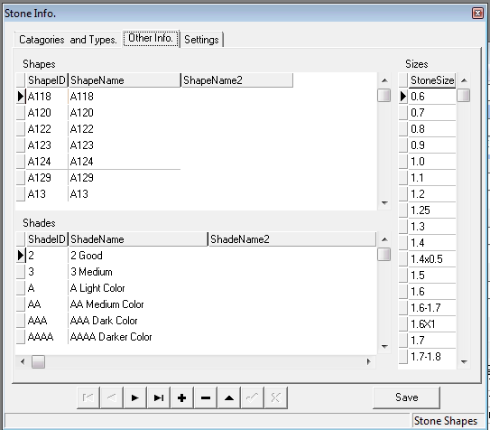

Here you can manage the `Shapes`, `Shades` and `Sizes` database.

##### Settings
By clicking on `Settings` you got :
Here you can manage the setting database, it contains the differents costs labor of settings.

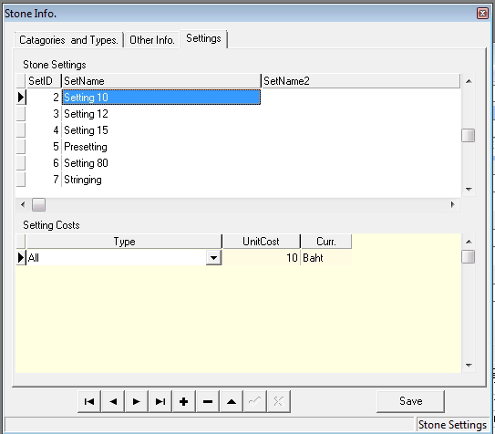

#### Unit Costs
By clicking in `Manage/Stones And Diamonds/Unit Costs` you arrived on the `Stone Cost Chart.` page.

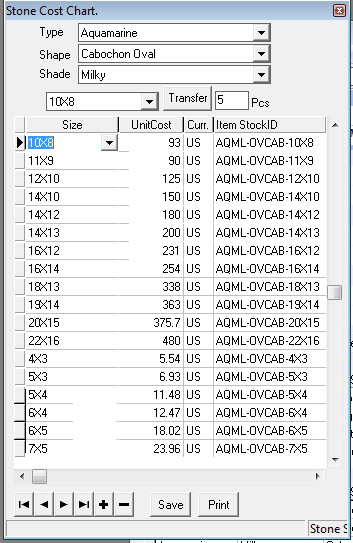

It contains all the prices of each stones per details.
The cost is given by the *Purchaser* from his supplier.

Here you can manage this database.
You can also create a **PDF** of the price details by clicking on `Print`.
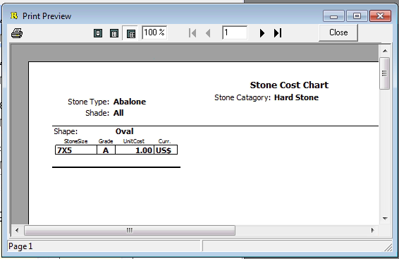

I don't know what is `Transfer`. His description is : Transfer to Product Form's stone detail.

#### Unit Weights
By clicking in `Manage/Stones And Diamonds/Unit Weights` you arrived on the `Stone Weight Chart.` page.

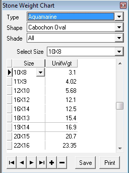

It contains all the weight for wich size in carat.

### Manage Metals
By clicking in `Manage/Metals` you arrived on the `Metal Info.` page.

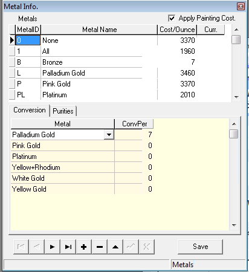

In this view of the database of the metals you can see the differents metal, there id and the the cost per ounce (`Cost/Ounce`) in **usd**.

At the bottom you can find the table `Conversion`.

It show a percentage for the conversion of weight for each metals. So for exemple Palladium Gold is 7% more heavier than usual gold.

The other table in `Purities` show purity per notation.
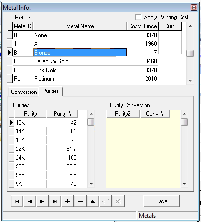

### Manage Parts
By clicking in `Manage/Parts` you arrived on the `Parts` page.
This is a view of the part database.

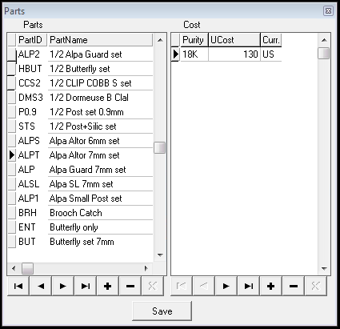

For each one you have its name, puricy and costs.
You can add or remove parts with the `+` and `-` button.

### Manage Margins
By clicking in `Manage/Margins` you arrived on the `Margins` page.

This is a view of the `Margin` database where you can manage it. Here are his primary fields :
* `ID`
* `MarginName`
* `Inactive` (bool)
* `Metal`

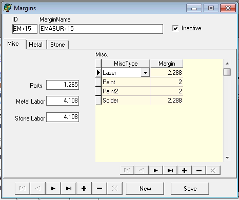

By default the `Misc` sub-view is opened.
Here you can manage those fields of the sub-table:
* `Misc`
    * `Parts`, `Metal Labor`, `Stone Labor`
    * `Misc`
        * `MiscType` (Lazer, Paint, ...)
        * `Margin` 

By clicking on `Metal` you switch on the sub-view of the metal details.
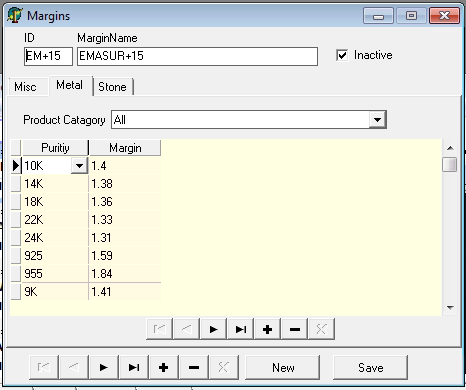

You can find here the margin by purity of the metal.
* `Metal`
    * `Purity`
    * `Margin`
    
Here `Product Category` seems like a mistake.

By clicking on `Stone` you switch on the subview of stones details.
You will find two menue and by default be on `Conditional`.
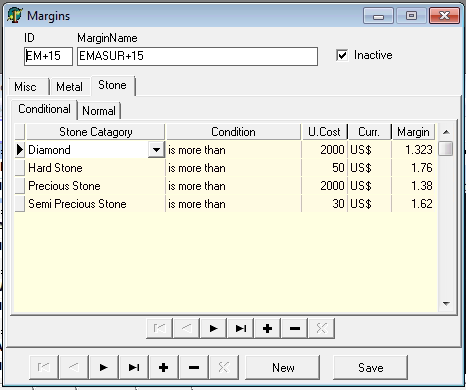

Here you can manage some conditional rules on the margins of stones.

By clicking on `Normal` you switch on the table of margins per stones.
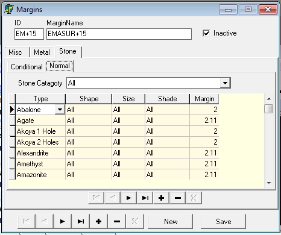

Here the margin depends of the stone and his specs (shape, size, shade).

### Manage Ornament Categories
By clicking in `Manage/Ornament Categories` you arrived on the `Ornament Catagories Info.` page.

This view of the ornament database give the waste of gold associated to each ornaments.
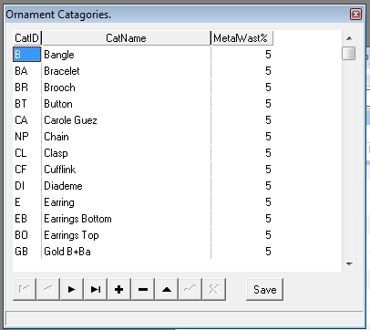

### Manage Currencies
By clicking in `Manage/Currencies` you arrived on the `Currencies` page.

This table give the rate change from a currency to Bath.

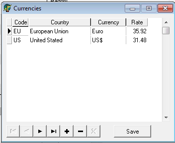

### Tools
In the toolbar you can find the menue `Tools` with three choices.

#### Options
Don't know bro.

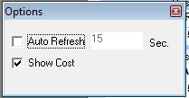

#### Reports
Create reports, really usefull.
You can notice the `Make Excel Sheet` option.
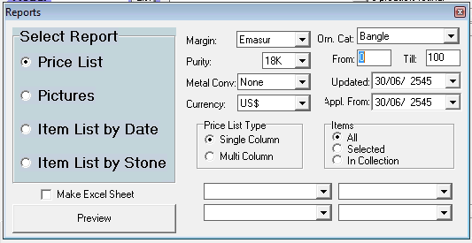

#### Check Data
Check in the databse for missing fields.

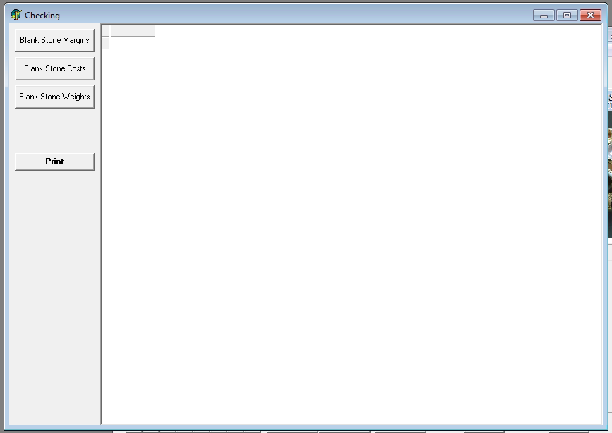

The process take some time. 

## Process

Those are on the format : `AAXXXB-CS+S1+S2+S3 + .. + SN/W`
With:
* `AAXXXB` : 
    * AA or A : The type (R: Ring, B: Bangle, BA: Bracelet, BR: Brooch, ...)
    * XXX: The chronological number of the model
    * B, C, .. or None : For model that are almost the same but cannot be differenciated with different references

* `CS+S1+S2+S3 + .. + SN/W` :
    * AAXXXB : Number of the model 
    * CS : The center stone (Or major stone)
    * Si : The other stones
    * W : For White Gold which is the **reference metal** (Withe Gold 18K)

### Create a new **Model**

This process describe how too create a new `Model` on **PDP**.
We consider here that you are on the main page.

* You are on the main page called `Product Definition and Pricing (PDP)`.
* Click on `List` next to `Model XXXX`.
* Select the type (Bangle, Bracelet, Ring, etc)
* Select the last model `AAXXXB`
* Click on `Select`
* Increment of one the model's number `AAYYYB` = `AA(XXX+1)B`
* Press `Enter`
* Click on `Save`
* Click on `New`
* Enter the color of your product in this format `AAYYYB-CS+S1+S2/W`
* Click on `Make blank`
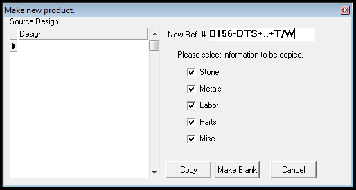
* Fill `Stones` table
    * `LinNum` have to be unique but there is no naming standards
    * Make sure the stones is already registered with its price elsehwere you will go an error : 
    
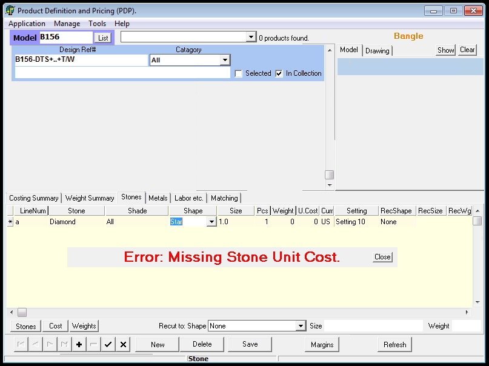

* Click on `Save`
* Fill `Metals` table
* Click on `Save`
* Fill `Labor etc.` tables
* Click on `Save`

### Create a new **Reference** (or **Product**)
Creating a reference is taken an existing model but with differents materials.
We see here how it should be done.

You need to create a new reference from an existing model `AAXXXB`.

* You are on the main page called `Product Definition and Pricing (PDP)`.
* Search next to `Model` the model with `AAXXXB`
* Press `Enter`
* Click on `New`
* Choose a design with similar materials to the new in `Design`
* Enter the color of your product in this format `AAXXXB-CS+S1+S2+S3 + .. + SN/W`
* Click on `Copy`
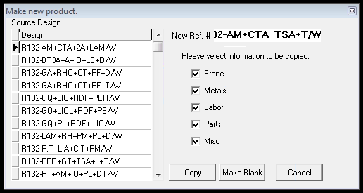
* Fill `Stones` table
    * `LinNum` have to be unique but there is no naming standards
    * Make sure the stones is already registered with its price elsehwere you will go an error : 

* Click on `Save`
* Change in `Labor etc.` tables the fields `Parts` and `Misc` if needed.
* Click on `Save`

### Add Type of Stone

* Click on `Manage/Stones And Diamonds/Types, Shape etc.`
* You arrive on `Stone info.`
* Indicate Category (Diamonds or Hards Stone or ...)
* Click on `+` 
* Fill the field `TypeID` with a unique identifier code
* Fill the field `Name`
* Fill the field `Wgt x n` with the density in function of a reference
* Click on `Save`
* If not unique PDP send an error 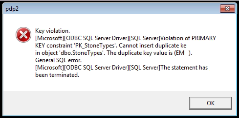
    * Correct the error or delete the stone (PDP do not do it himself)
* Close `Stone Info.`

### Add Specific Stone 

We know how to add a kind of stone, but this is not really interesting. The most important part is adding in the database a stone of a specific color, shape, shade, ... and his associated costs.

We consider here a stone that have been added. We need to consider specific caracteristics for a particuliar order.

* Click on `Manage/Stones And Diamonds/Unit Costs`
* Select 
    * `Type` of stone
    * `Shape`
    * `Shade`
    * `Size`
-> /!\ Eclaircissement sur `Transfer`et `Pcs`
* Click on `+`
* Fill `Size` with a unique field (otherwise the stone already exist)
* Fill `UnitCost` (Purchaser need to fill it actually)
* Click on `Save`

* Click on `Manage/Stones And Diamonds/Unit Weights`
* Select 
    * `Type` of stone
    * `Shape`
    * `Shade`
* Click on `+`
* Fill `Size` with a unique field (otherwise the stone already exist)
* Fill `UnitWgt` with a the weight in carat
* Click on `Save`

