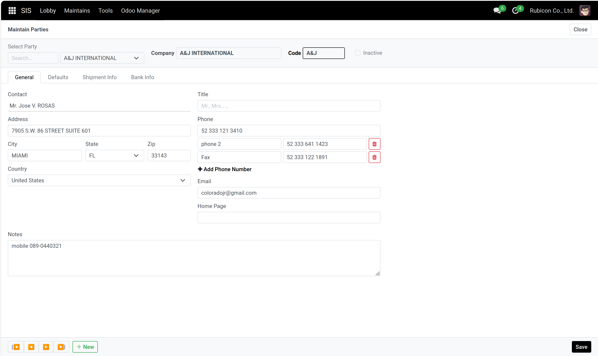
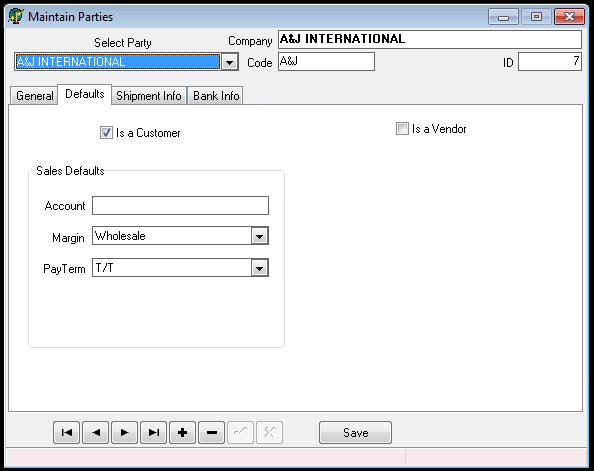
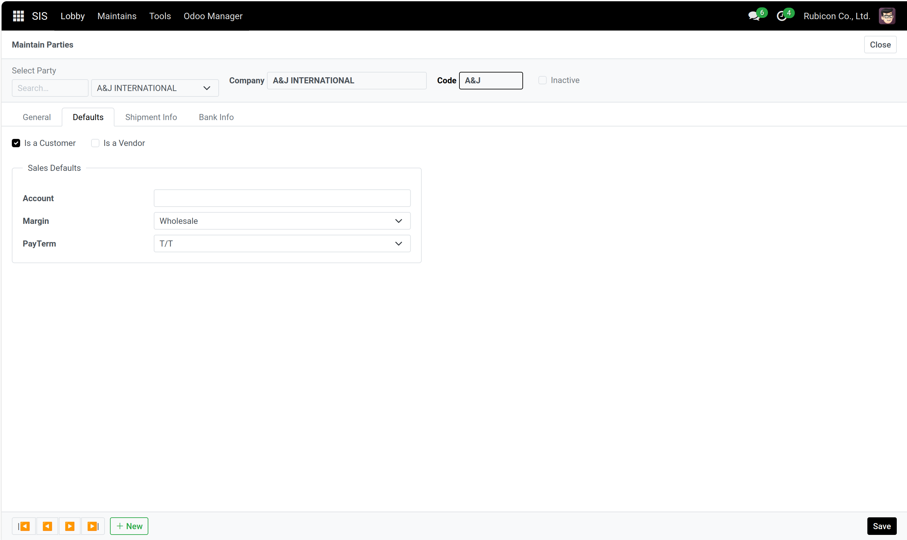
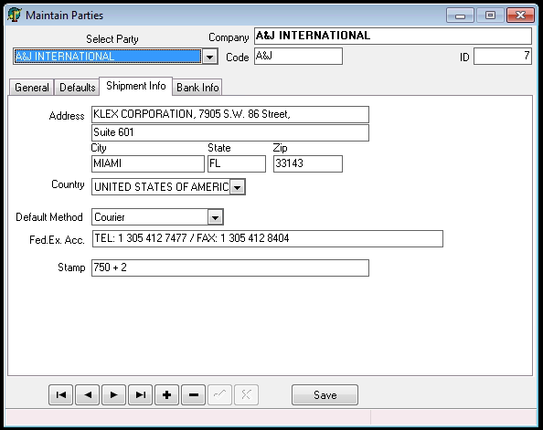
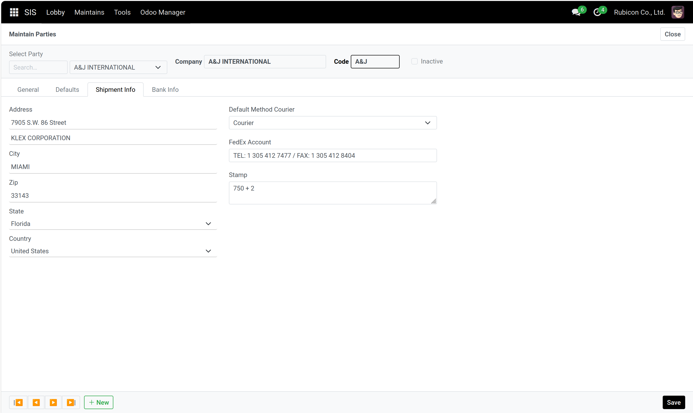
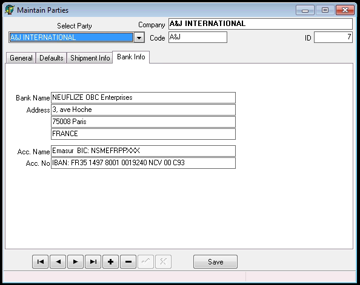
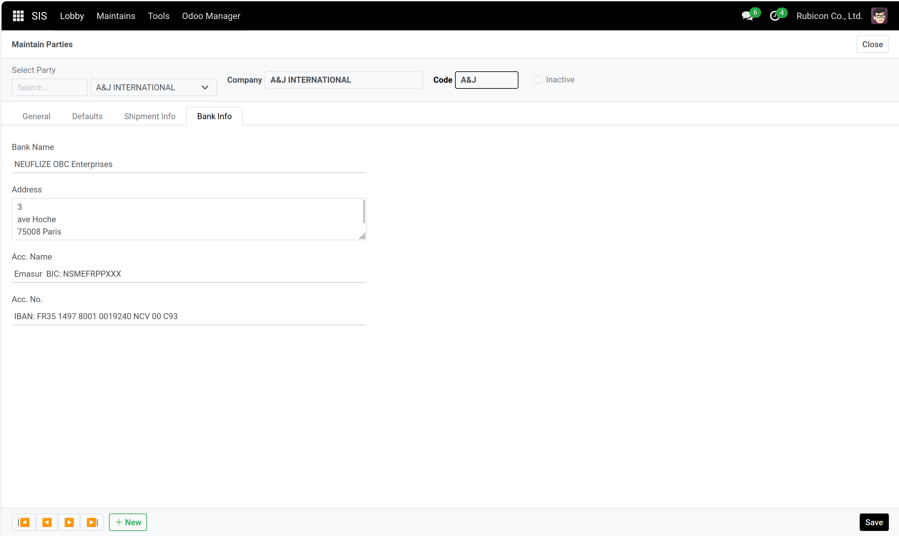

# Rapport Avancement : SIS Parties

On va venir comparer les données exfiltrés et donc SIS-ODOO à SIS pour la fenêtre Parties.

## General

### SIS 


### Odoo



On a bien toutes les données. 
J'ai rendu modulaire les numéro de téléphone (possibilité d'ajout de numéro de téléphone avec un label tel que Fax, mobile, ... )

Group : j'ai un doute sur son utilisation et son utilité.

Dans note, j'ai retiré le message redondant :
```
Remark
1. The diamonds here in invoiced have been purchased ...
```

## Defaults
### SIS

### Odoo


Identique et avec les mêmes données.


## Shipment Info

### SIS

### Odoo


## Bank Info

### SIS

### Odoo



