## PDP

Voici où nous en sommes dans PDP :

### Vue Principale
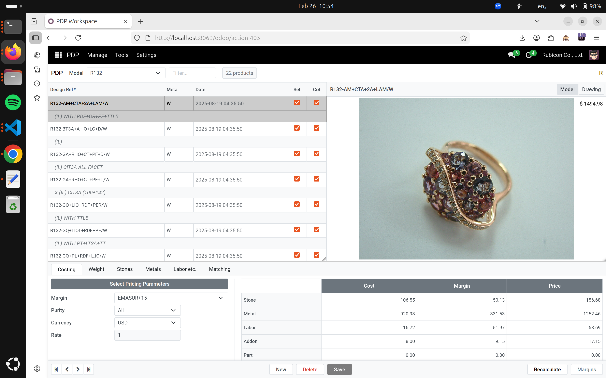

### Détails de la Page Principale
J'ai ajouté la possibilité de faire varier la taille des fenêtres.
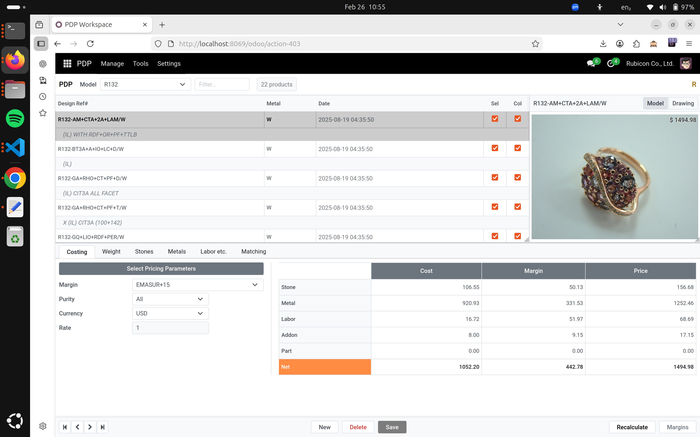

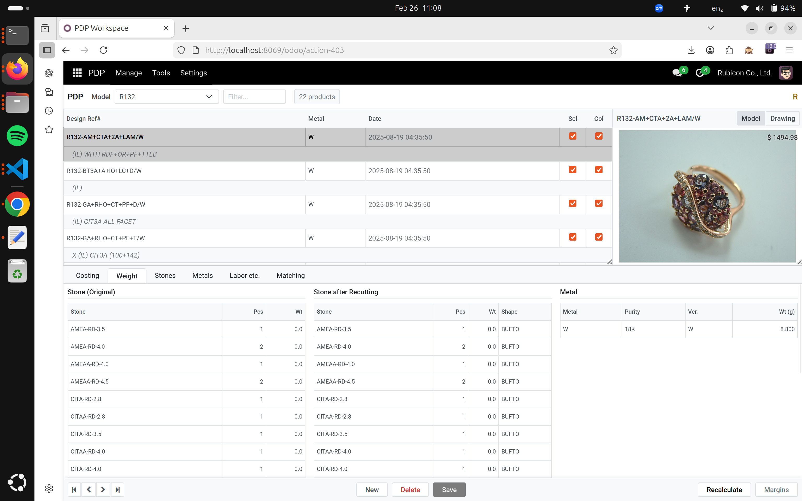
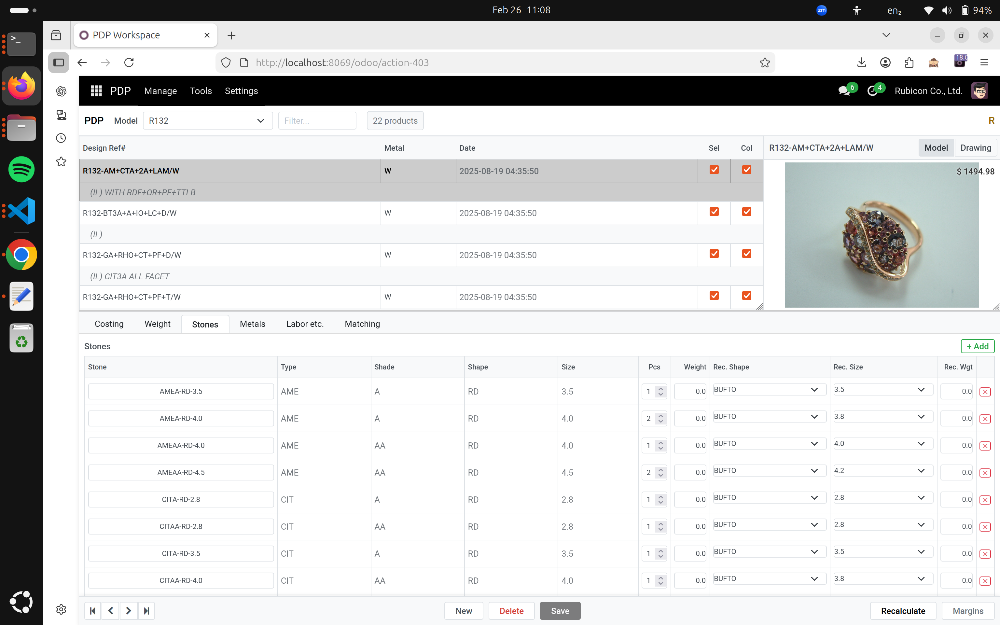
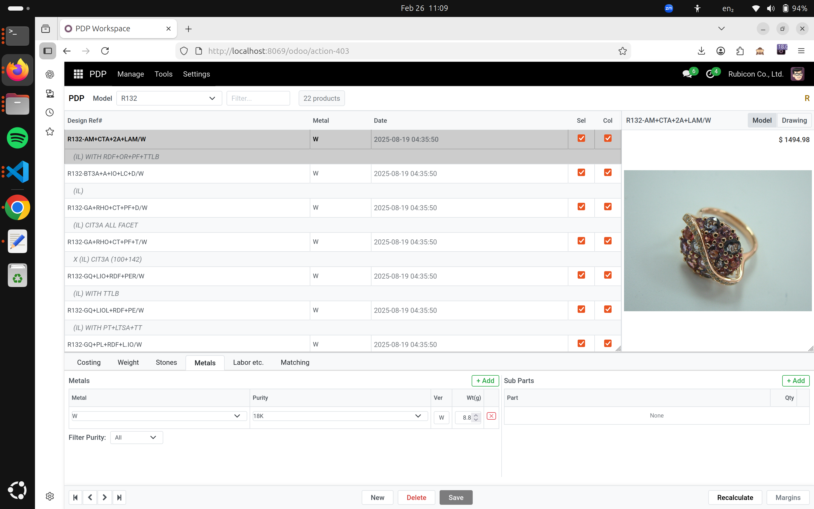
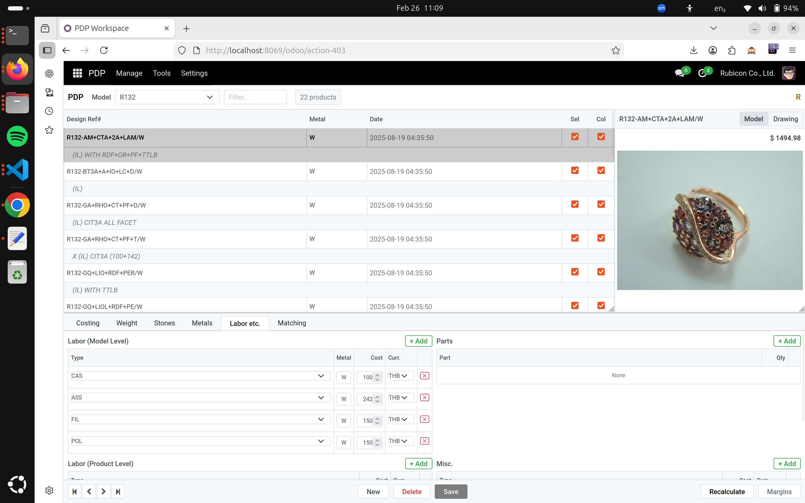
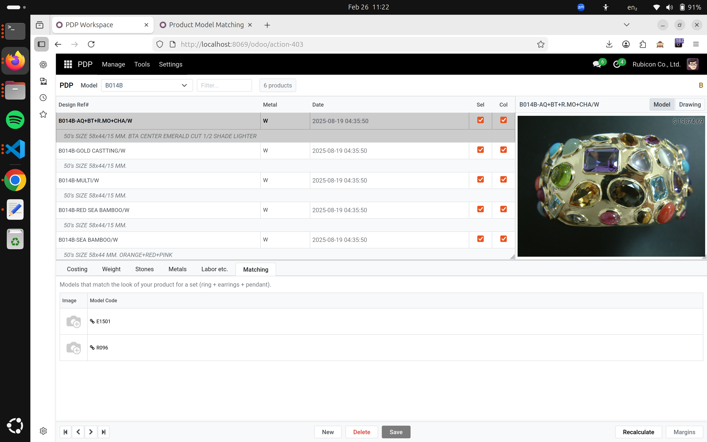

### Gestion (Manage)
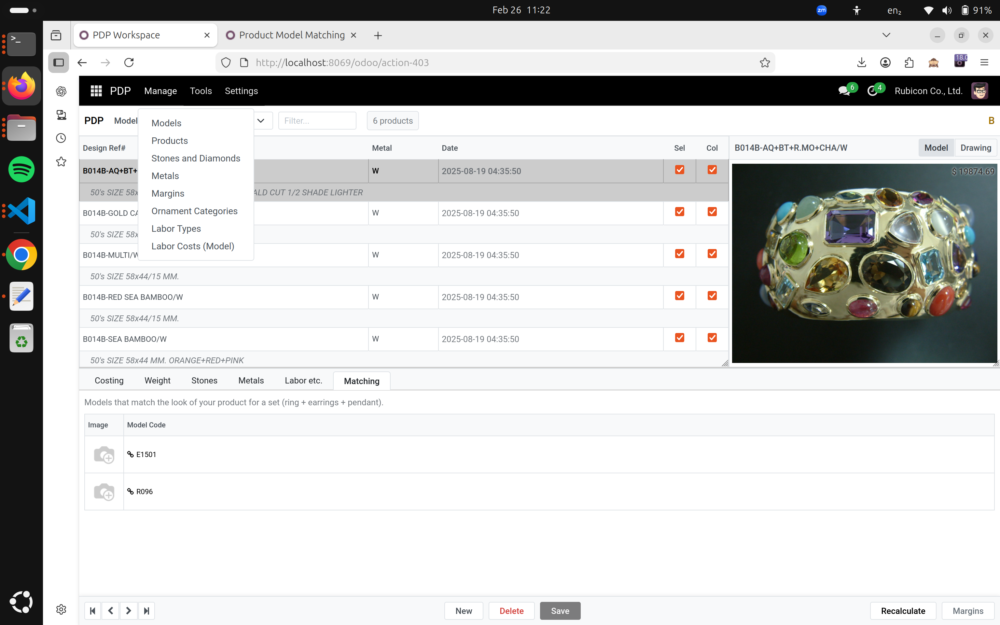
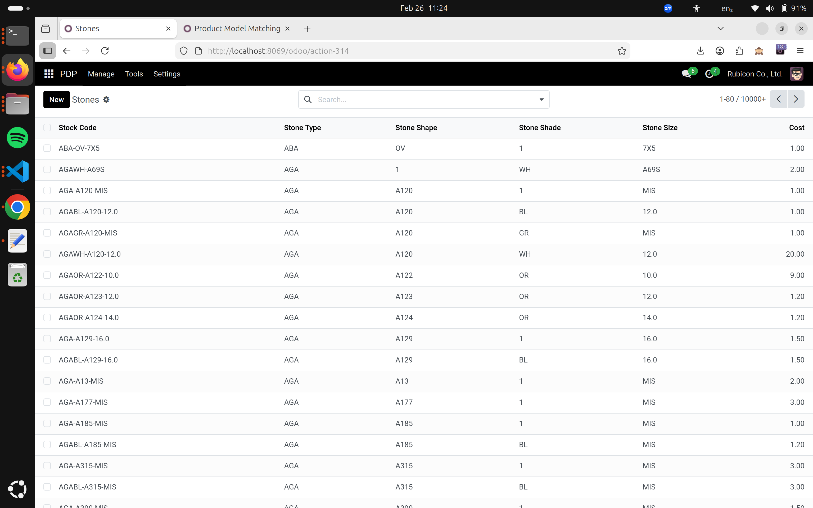
Les autres menue sont semblables à celui-ci pour gérer les métaux, ...

### Marges
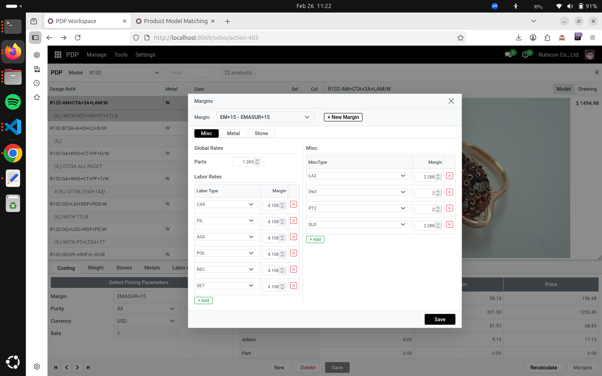
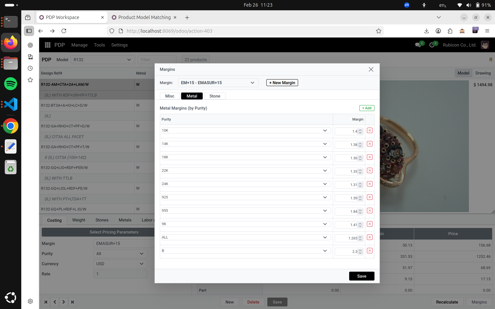
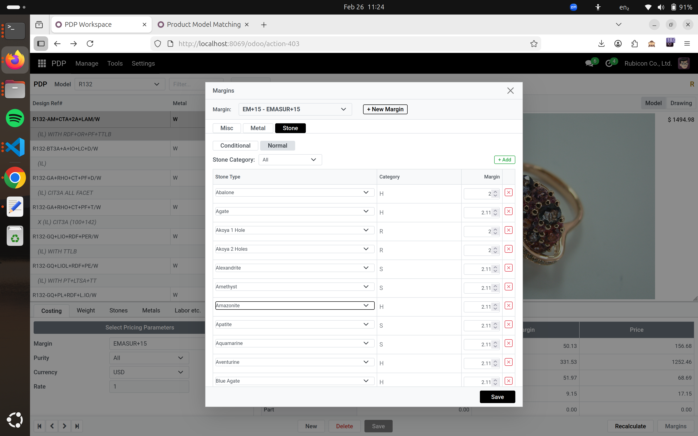
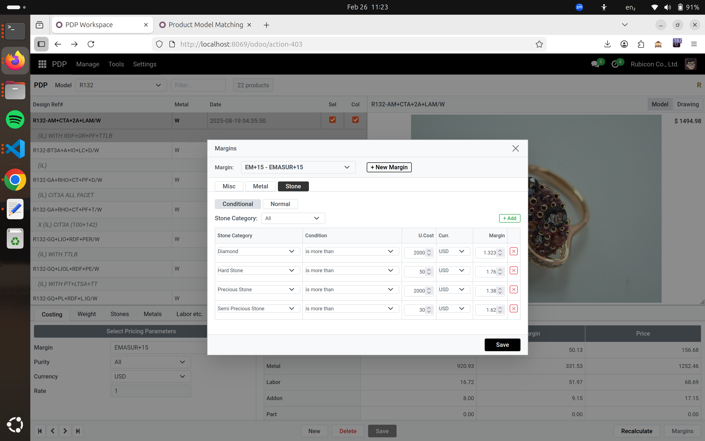
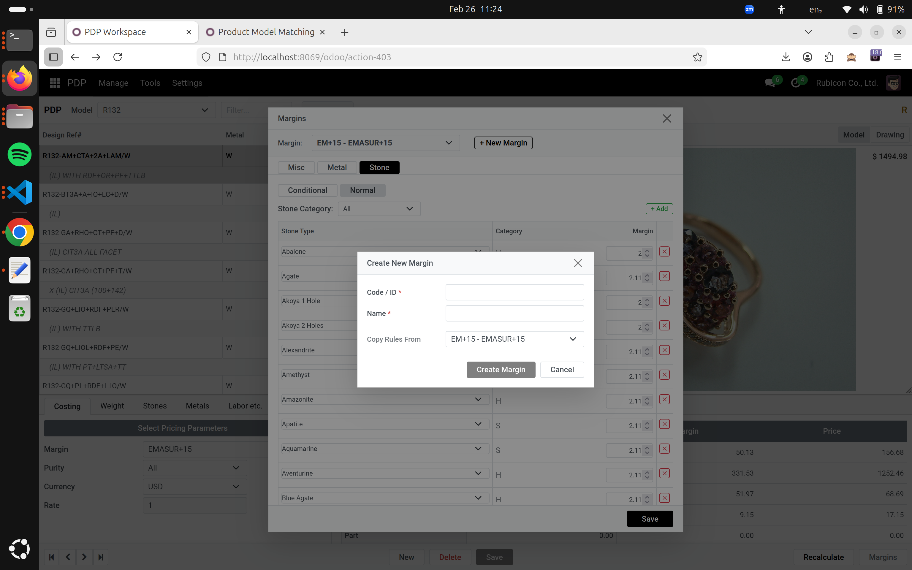

 
