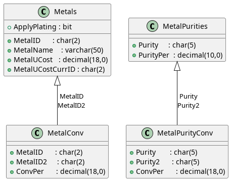
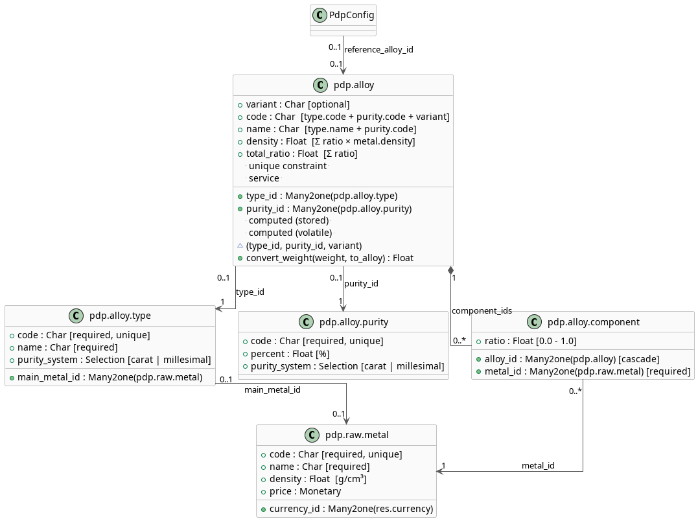
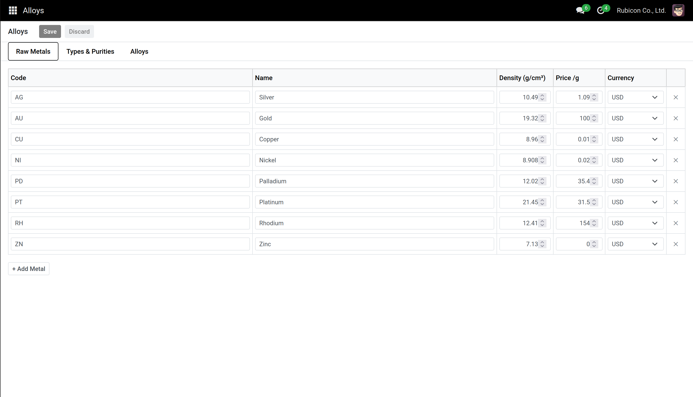
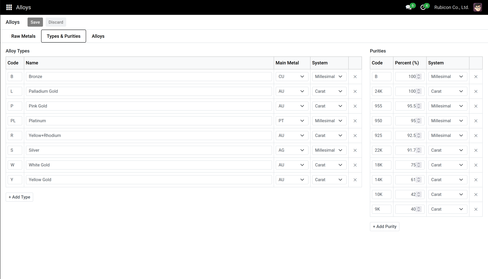
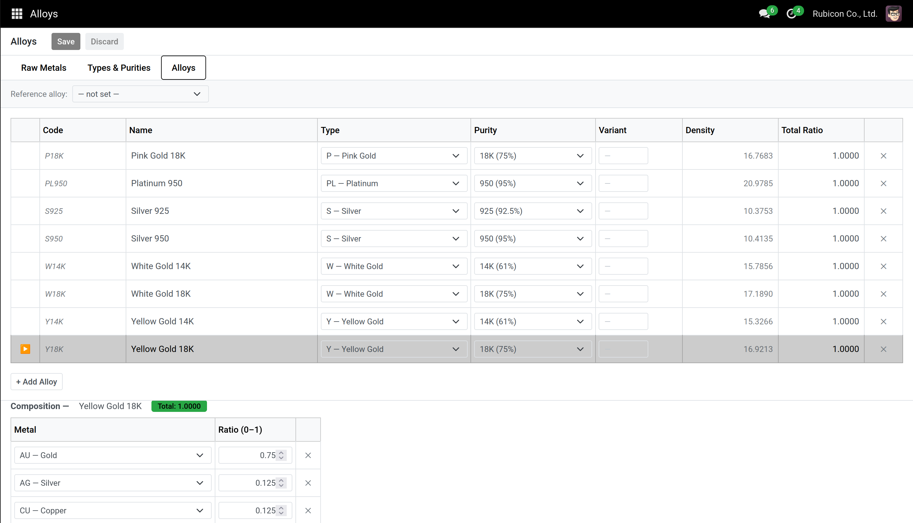

# Metal Alloy

Proposition de refonte des tables de métaux.

L'idée de la refonte est d'éclaircir les calculs de composition, de conversion et de prix des métaux.
Actuellement la composition des alliages n'est pas claire voir pas renseigné du tout ce qui pose problème pour le calcul du prix des métaux.

On veut dorénavant des alliages explicites qui permettent de vérifier la composition facilement.

## Ancien système

L'ancien système ne permet pas explicitement de calcul de conversion sans donner soit même les taux de conversions. Il demande donc de précalculer pour chaque Metal donné le taux de conversion. Ce taux n'est pas si évident a calculer et c'est pourquoi ce système n'est actuellement pas utilisé dans PDP au vu de la table de conversion qui contient 7% pour un valeur et 0% pour les autres (même par exemple entre le bronze et l'or).

## Nouveau système

Dans le nouveau système on va considérer quatre tables :
* `Raw Metal` 
* `Alloy Type` 
* `Purity`
* `Alloy`

Voici son diagramme.

### Raw Metal

Le fait de considérer une table à part pour les métaux bruts permettent de mieux gérer leur densité (qui sera bien fixe). Mais aussi leur prix (et notamment dans l'idée d'avoir le prix du metal soit par défaut soit en fonction du jour et du marché).

### Types & Purity

`Types` correspond au type d'alliage. Tel que l'or blanc, rose ou jaune. Cela permet par la suite de mieux les rassembler selon leur type. On y indique le métal principale et donc le système de poid associé. 

`Purity` contient les noms des puretés possibles et leur systèmes associés.

### Alloy

Enfin `Alloy` contient les colonnes :
* `code` généré automatiquement selon le type, la pureté et de manière optionnel un variant
* `Name` comme précedement
* `Type` 
* `Purity` qui proposera la pureté en fonction du type choisit (si White Gold : système Carat | Si bronze : système millesimal)
* `variant` champ optionnel pour distinguer les alliages de même type et pureté
* `Density` champs automatique déduit de la composition
* `Total Ratio` champs permettant la vérification de la composition

Sous cette table ce tient une sous-table qui possède la composition de chaque alliage. On indique ici le métal brut et son ratio. Si le totaux des ratios est inférieur à 1.0, cela renvoi un *Warning*. Si strictement supérieur une *Error*.

### Conclusion

Cette version permet de donner les conversion exacte avec des calculs clair. Chose impossible avec les tables précédentes. De plus, elle permet de mieux gérer les prix des métaux en fonction du marché et de la date. 

