# Sales Information System (SIS)

## Detailed Description 

### Lobby
When you have entered your identifiant, you arrive on the lobby page that have the name of the software `Sales Information System (SIS)`.

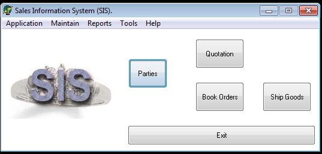

### Parties
By clicking on `Parties` a new window appeared named `Maintain Parties`.

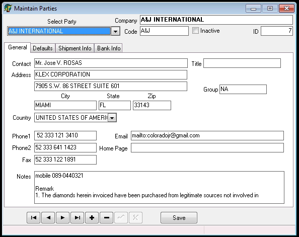

The window is here to manage the parties database (or client).

#### Top of the page

By clicking on the down arrow below `Select Party`, a drop-down menu appeared.

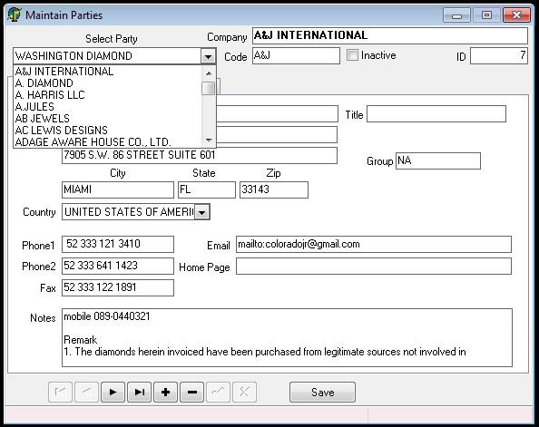

Here you have all the already record parties in lexicographical order.

Than the general fields are written :
* `Company` name of the company
* `Code` its identifier code, will be written on the series number of products
* `ID` identifier key in the database
* `Inactive` (bool) by default is False

Those fields are the required fields needed for having an instance of Party and so for his creation.

The following fields are nullable.

#### General

By clicking on `General` (default view) you have a view of the general information (Contact, Address, etc)

You can edit those fields here :
Contact, Title, Address (Country, City, State, Zip), Groups, Phone, email, fax, home page and notes.

#### Defaults
By clicking on `Defaults` the following view is displayed.

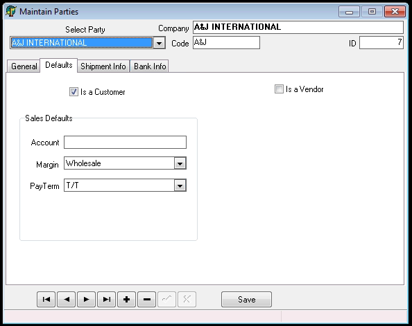

If you tick `Is a Vendor`, it display more options.

You can edit those fields here :
Account, Margin, PayTerm.

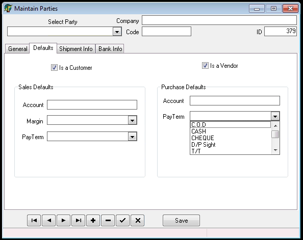

The drop-down menu `Margin` contains the one that are managed on `PDP`.

Remarks :
 * Account is generally empty

    If find only two parties that contains it 
    * Kemeya : BKK Feb 12
    * Tank : 18%

 * The `Vendor` is generally no used. Only two occurences found :
    * Lenovre Jewelery
    * TC

So those fields are considered useless.

#### Shipment Info
By clicking on `Shipment Info`  the following view is displayed.

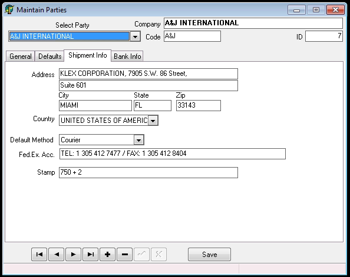

You can edit those fields here :
Address (Country, City, State, Zip), Default Method, Fed. Ex. Acc. and Stamp. 

#### Bank Info
By clicking on `Bank Info`  the following view is displayed.

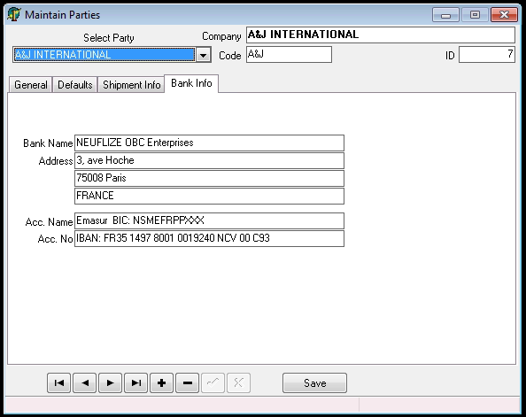

You can edit those fields here :
Bank Name, Address, Acc. Name, Acc. No.

#### New 

By clicking on `+`, display an empty Party.

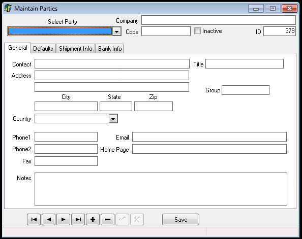
From here in `Defaults`, `Shipment Info` and `Bank Info` are blank in the same way as `General`.

The `ID` field have been automatically created. It seems to increment of one for each party created.

For adding a new party you have to fill the general field at the top first `Company` and `Code`. `Inactive` is by default on *False*.

Then you can click on `Save` to create the instance.

If you do not do it SIS will send an error.
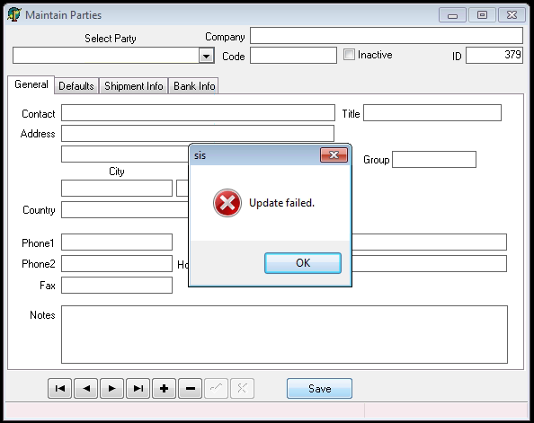

This error will also be send if you empty one of the general field on an instance.

###  Quotations, Book Orders and Shipment Goods

Those pages are quite similar. We will called the general format a `Document` Manager window.

By clicking on `Quotations` you arrived on `Maintain Sales Quotations.`, this is used with new client or client where there is a possibility of `Cancellation`. 
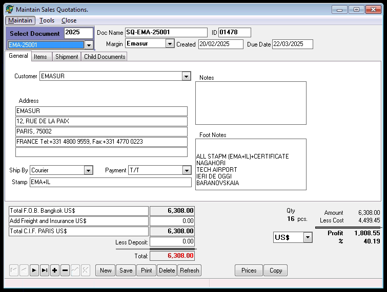

By clicking on `Book Orders` you arrived on `Maintain Sales Orders.`, this is used to  manage and create **Sales Orders**.
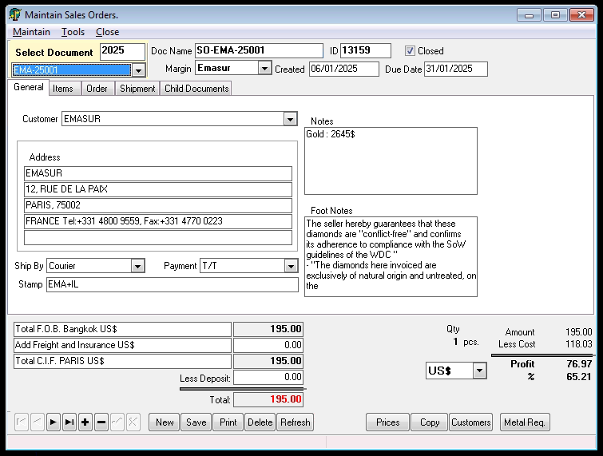

By clicking on `Shipment Goods` you arrived on `Maintain Sales Invoices.`, this is used to manage and create **Invoices**.
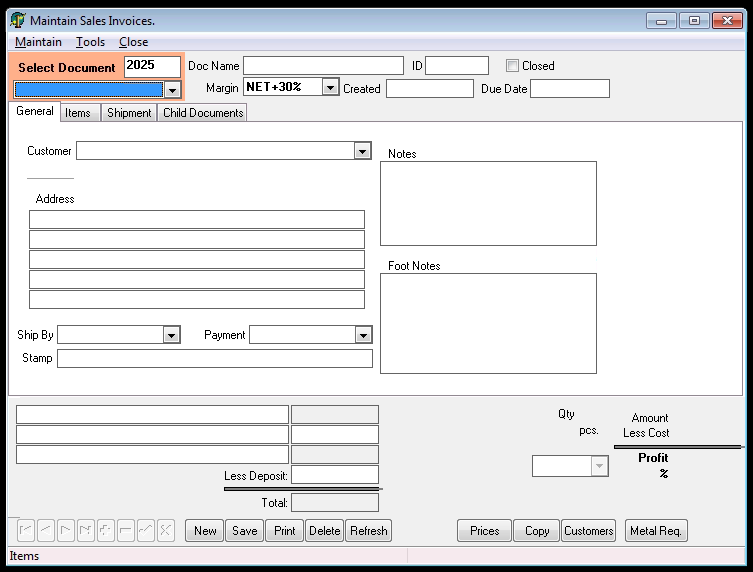

Here you can see that they are almost exactly the same. In `Orders` you can find one more option, the menu `Order`. So we will focus on the `Sales Orders` pages.

#### Required Field

On the top of the page you can find the required fields.

* `Doc Name` name of the document
* `ID` identifier in the database
* `Closed` boolean 
* `Margin` choices on of the margins manage in PDP
* `Created` date of creation
* `Due Date` date of the expecting result (delivry limit for exemple)

#### General

By clicking on `General` (open by default), the following view is displayed.

You can edit those fields here :
Customer, Address, Ship By, Payement, Stamp, Notes, Foot notes.

#### Items/General

By clicking on `Items/General`, the following view is displayed.
By default the `General` sub-menu has opened.

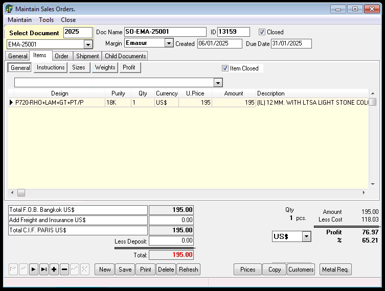

It contains a table with those fields :
* Design (`MODEL-COLORS/M`)
* Purity 
* Qty
* Currency
* U.Price
* Amount
* Description

You can find the references of the products ordered by the customer. With multiple informations.

#### Items/Instructions

By clicking on `Items/Instructions`, the following view is displayed.
By default the `Instructions` sub-menu has opened.

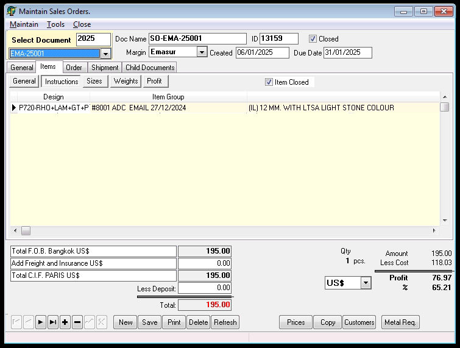

It contains a table with those fields :
* Design (`MODEL-COLORS/M`)
* Item Group 
* Special Instruction

You can find the references of the products ordered by the customer with the fields `ItemGoup` and `Special Instruction`.

#### Items/Sizes

By clicking on `Items/Sizes`, the following view is displayed.
By default the `Sizes` sub-menu has opened.

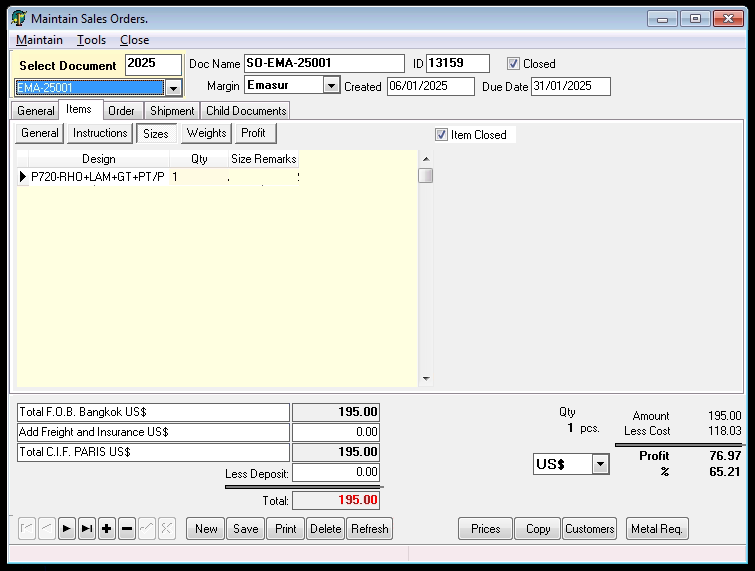

It contains a table with those fields :
* Design (`MODEL-COLORS/M`)
* Qty
* Size Remarks

You can find the references of the products ordered by the customer with the fields `Qty` and `Size Remarks`.

#### Items/Weights

By clicking on `Items/Weights`, the following view is displayed.
By default the `Weights` sub-menu has opened.

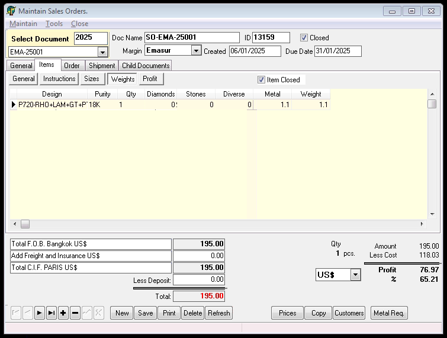

It contains a table with those fields :
* Design (`MODEL-COLORS/M`)
* Purity
* Qty
* Diamonds
* Stones
* Diverse
* Metal
* Weight

You can find the references of the products ordered by the customer with fields that details the weight.

#### Items/Profit

By clicking on `Items/Profit`, the following view is displayed.
By default the `Profit` sub-menu has opened.

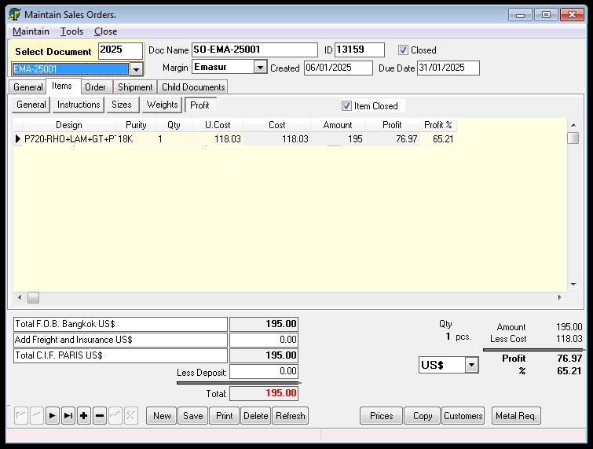

It contains a table with those fields :
* Design (`MODEL-COLORS/M`)
* Purity
* Qty
* U. Cost
* Cost
* Amount
* Profit
* Profit %

This table details the profit calculation by reference.

#### Order

By clicking on `Order`, the following view is displayed.

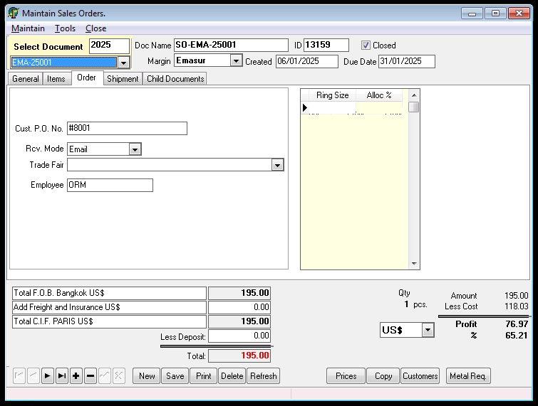

You can edit those fields here :

* `Cust P.O. No.` stands for *Customer Purchase Order Number*, this is the reference number from the client.

* `Rcv, Mode` stands for *Receiving Mode*.

* `Trade Fair` is used if the order was made during one.

* `Employee` contains the name of the employee responsible of this order.

#### Shipment

By clicking on `Shipment`, the following view is displayed.

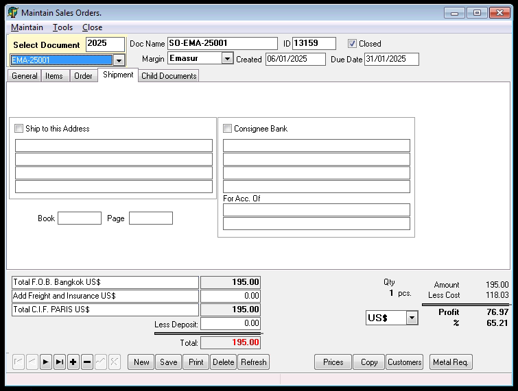

You can edit those fields here :
Ship to this Address (bool), Consignee Bank (bool), For Acc. Of, Book, Page

If needed, you can specify delivery details here.

#### Child Documents

By clicking on `Child Documents`, the following view is displayed.

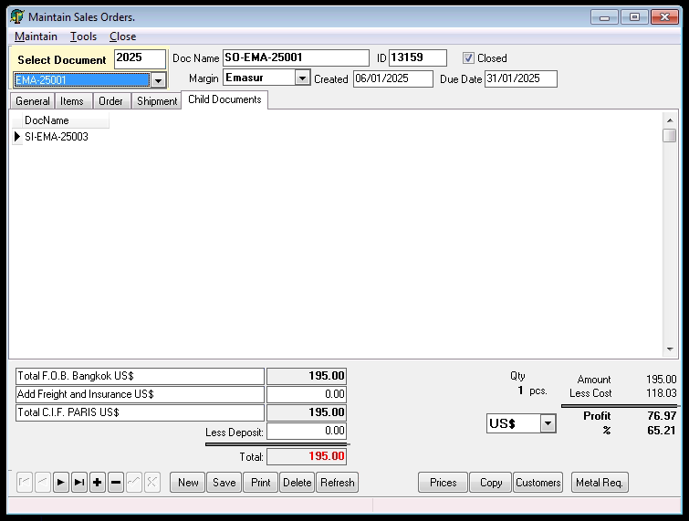

It contains a table with only one field `DocName` (`DOCTYPE-AAA-XXXXX`). 

List `Document` that come from the current one. In this case we have a sale order SO-EMA-250001 which has been sent through the sale invoice SI-EMA-250003.

It can happen that multiple invoices are used for one order. And than on one invoice it contains product from differents sales order.

#### Profit Details

At the bottom of the page you have the details of the profit. 

It contains those fields that are computed automatically.
* Total F.O.B Bangkok US$
* Add Freight and Insurance US$
* Total C.I.F PARIS US$
And 
* Less Deposit
* Total

Finally on the right you can specify the currency with a drop-down menue.
And an other table show :
* Qty
* Amount
* Less Cost
* Profit
* Profit in %

#### New

By clicking on `New` at the bottom of the page, a new instance of a sales is created.
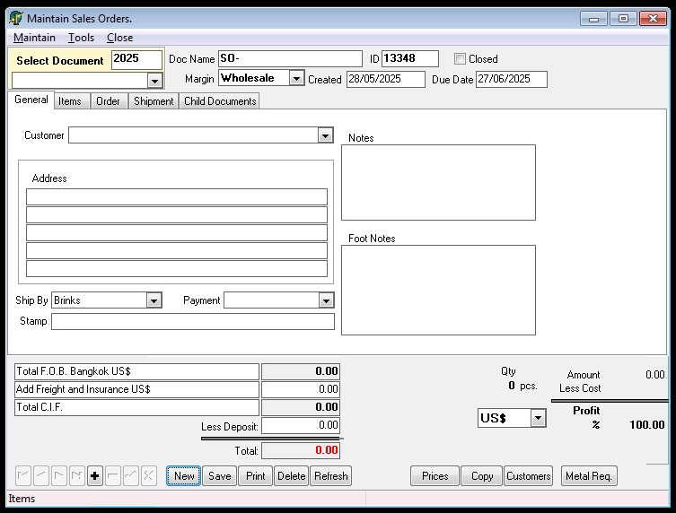

All the fields `Items`, `Order`, `Shipment` and `Child Document` are empty like `General`.

We can notice that **by default** the document type is indicate:
* `Doc Name` : 
    * `SQ-` for `Quotations`
    * `SO-` for `Sales Order`
    * `SI-` for `Sales Invoice`
* `ID` : automatically created by incremeting from the last one
* `Closed` : False by default
* `Margin` :  Wholesale
* `Created` : the current date 
* `Due Date` : One monthe after the current date

#### Print

By clicking on `Print` at the bottom of the page, the window `Print Document` will be displayed.

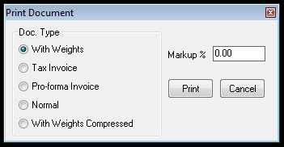

Here we can notice :
* `With Weights` : Print the sales orders/quotations with the weights details

Remarks : 
* Actually only the `With Weights` format is used.

#### Prices
By clicking on `Prices` at the bottom of the page, the window `Product Prices.` will be displayed.

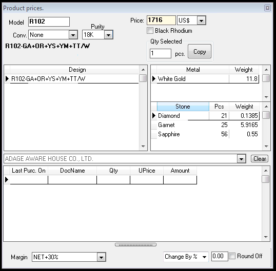

Here you can indicate :
* Model
* Conv (other metal than white gold)
* Purity
* Qty 
* Select a design
It will gives you on two tables details on the product.
One table with Metal, Weight and the other with Stone, Pcs, Weight
Then you have at the top the field `Price` that indicate the price, you can also choose the currency with a drop-down menu.

A table at the bottom seems to refers to similar orders. It contains those fields :
* Last Purc. On
* DocName
* Qty
* Uprice
* Amount

And a drop-down menu allows you to select a specific customer.

On this window you can search in the database manage by PDP the model and references of products. It allows you too indicate the appropriate prices for each item.

#### Copy
By clicking on `Copy` at the bottom of the page, the window `Document Browser` will be displayed.

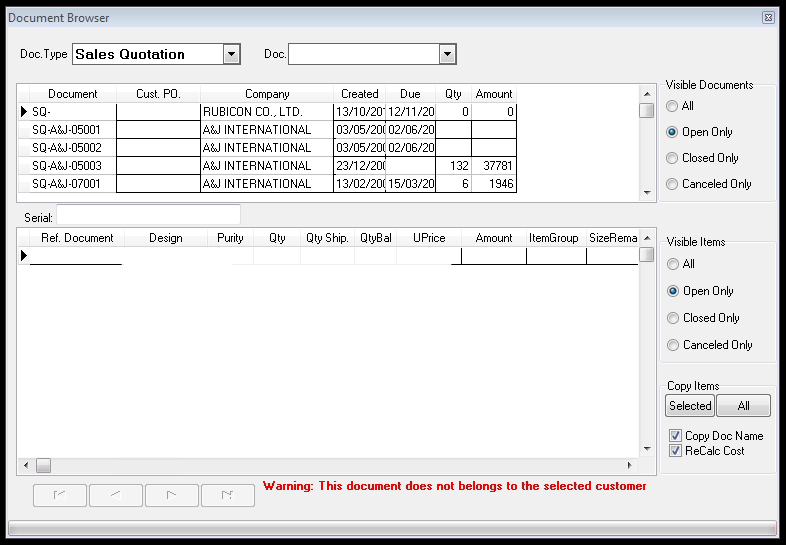

Here you can filter by `Doc. Types` and `Doc.` with a drop-down menu and by their boolean attribute : `Open`, `Closed`, `Canceled` with tick boxes.

Then on the table bellow it, the documents appeared with those fields :
* Document (`DOCTYPE-AAA-XXXXX`)
* Cust. PO. (empty here)
* Company
* Created (date)
* Due (date)
* Qty
* Amount

Then a second table where you can filter with the field `Serial` contains those fields :
* Ref. Document
* Design
* Purity
* Qty
* Qty Ship.
* QtyBal
* Uprice
* Amount
* ItemGroup
* SizeRemarks
* ...

This window allows you to copy `Item` from other `Document` of any kind.
Because you are on `Sales Orders` it look at `Sales Quotation` by default. 

#### Customers
By clicking on `Customers` at the bottom of the page, the window `Maintain Parties` will be displayed.

#### Metal Weight Summary
By clicking on `Metal Req.` at the bottom of the page, the window `Metal Weight Summary` will be displayed.

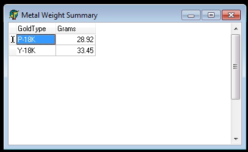

It contains a table with two fields : 
* GoldType (`M-PURITY`)
* Grams

#### Toolbar Maintain

By Clicking on `Maintain` you have a drop-down menu that appeared.

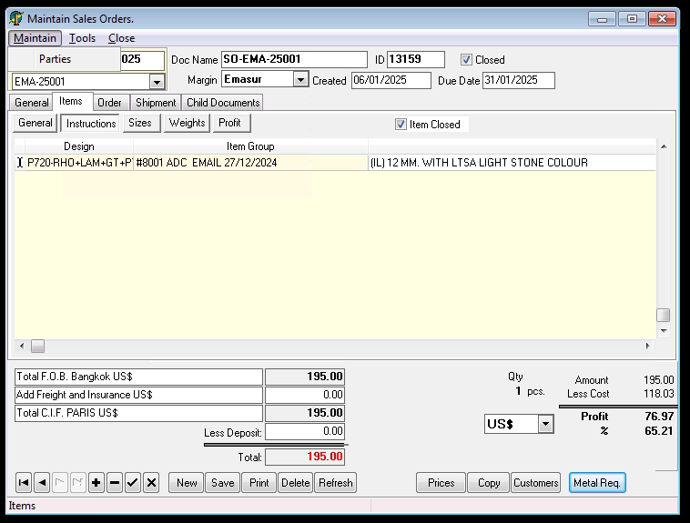
With only `Parties` that will open the `Maintain Parties` window seen before.

#### Toolbar Tools

By Clicking on `Tools` you have a drop-down menu that appeared.

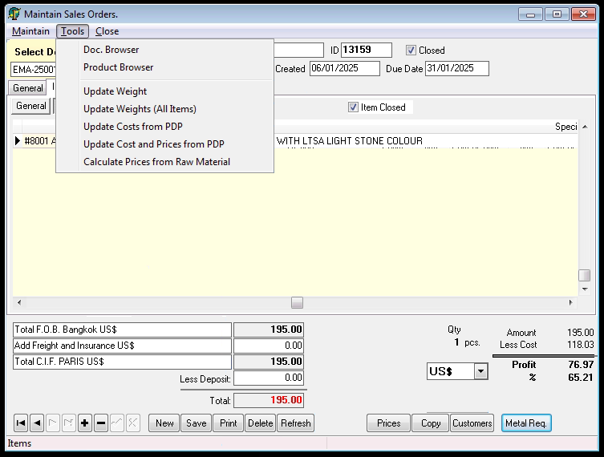

It contains those options :
* Doc. Browser : open the `Document Browser` window
* Product Browser : open the `Product Prices` window such as seen later 
* Update Weight
* Update Weights (All Items)
* Update Costs from PDP
* Update Cost and Prices from PDP
* Calculate Prices from Raw Material

All the ones that start with `Update` will check if changes occured on the database and will refresh accordingly the data.

Finally by clicking on `Calculate Prices from Raw Material`, the window `Update Price from Raw-Material` is displayed. 

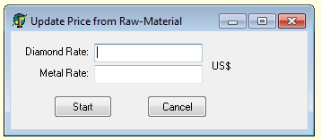

Here you can fill two fields :
* Diamond Rate
* Metal Rate
Then there is two buttons `Start` and `Cancel`.

### Lobby Application

On the toolbar, if you click on `Application` a drop-down menue appeared.
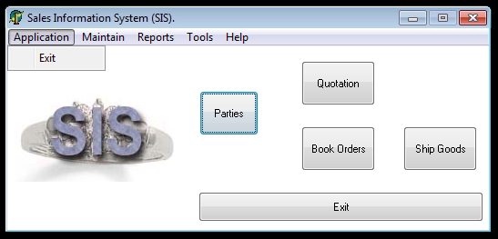
Here you have an `Exit` button.

### Lobby Maintain

On the toolbar, if you click on `Maintains` a drop-down menue appeared.
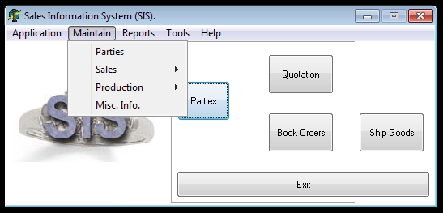

It contains those options :
* Parties
* Sales
* Production
* Misc. Info.

#### Parties

`Parties` will open the `Maintain Parties` window.

#### Sales
Clicking on `Sales` will display other possibilities on the drop-down menu.
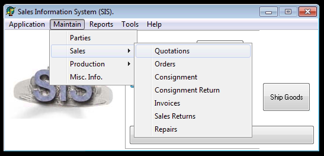

* Quotations
* Orders
* Consignment
* Consignment Return
* Invoices
* Sales Returns
* Repairs

All those sales documents have been seen earlier or have more or less the same format has `Quotations`, etc. It is other `Document Type` but less common.

#### Production 

Clicking on `Production` will display other possibilities.

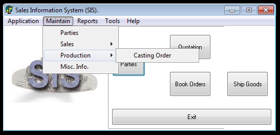

Which is also a `Document` manager window but his goal is unclear.

#### Misc Info

Clicking on `Misc. Info.` will open the window `Miscellaneous Information`. 
This window manage multiple table of general information. You can edit those information and save them by clicking on `Save` at the bottom-right of the page.

##### Business Areas
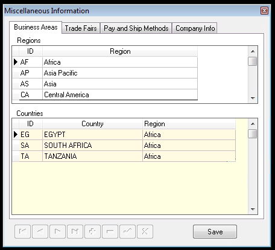

Such as : 
* `Region` : ID , Region
* `Country`: ID, Country, Region
on the `Business Areas` sub-window.

##### Trade Fairs
Such as `Fair` on the `Trade Fairs` sub-window.
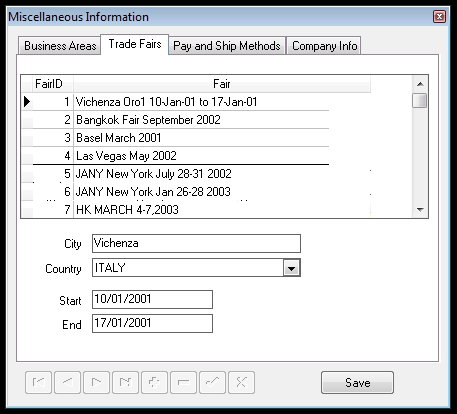

That contain for each `Fair` :
* FairID
* Fair
* City
* Country
* Start (date)
* End (date)

##### Pay and Ship Methods
Such as `Payment` and `Shipment` methods on the `Pay and Ship Methods` sub-window.
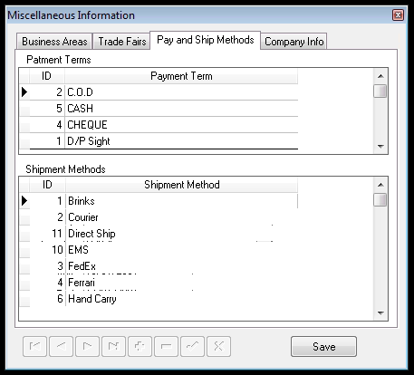

That contains two tables :
* Patment Terms (certainly payment terms) : ID, Payment Term
* Shipment Methods : ID, Shipment Method

##### Company Info

Such as `Account` info on the `Company Info` sub-window.

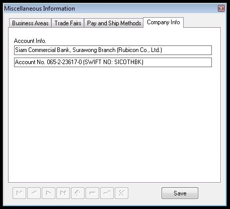

With a two fields named `Account Info.`.

### Lobby Reports

On the toolbar, if you click on `Reports` a drop-down menue appeared.
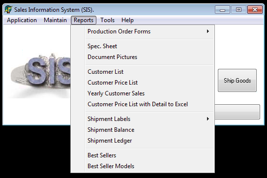

It contains those options :
* Production Order Forms
* Spec. Sheet
* Document Pictures
* Customer List
* Customer Price List
* Yearly Customer Sales
* Customer Price List with Detail to Excel
* Shipment Labels
* Shipment Balance
* Shipment Ledger
* Best Sellers
* BEst Sellers Model

#### Production Order Forms

By clicking on `Production Order Forms` other possibilities are displayed.
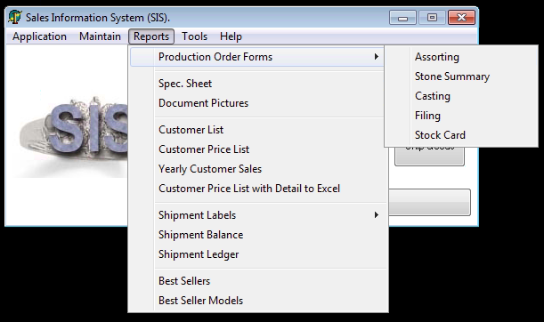

* Assorting
* Stone Summary
* Casting
* Filling
* Stock Card

##### Shipment Labels

By clicking on `Shipment Labels` other possibilities are displayed.
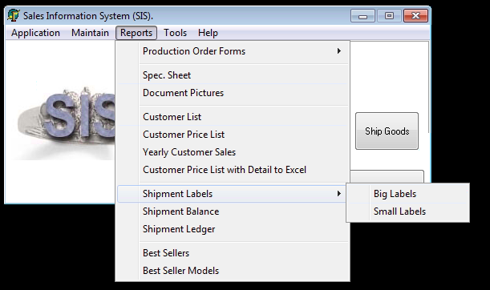

* Big Labels
* Small Labels

##### Report

All of the options that are in this menu allows you to create an appropriate reports. 

Clicking on one of these options will either generate the report directly or display the `Parameters window.

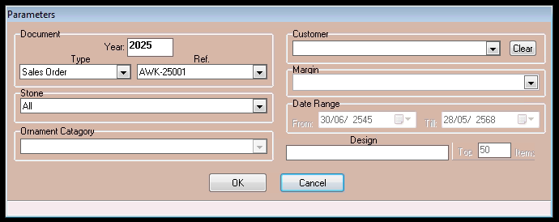

In this window, you can filter by :
* `Document` (year, type, ref,)
* `Customer` (name)
* `Stone`
* `Ornament Catagory`
* `Date Range` (between when and when)
* `Design`

And click on `Ok` to generate the report.

### Lobby Tools

On the toolbar, if you click on `Tools` a drop-down menue appeared.
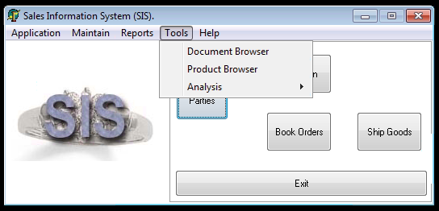

By clicking on `Document Browser` a window with the same name will open.
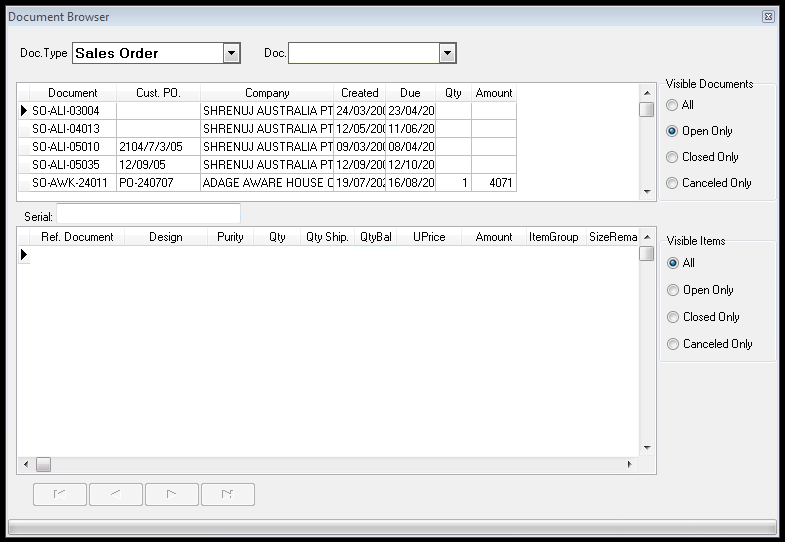
It allow you to search through all the kinds of `Documents` regardless their type (`Sales Order`, ...)

By clicking on `Product Browser` the window `Product Prices` will open.
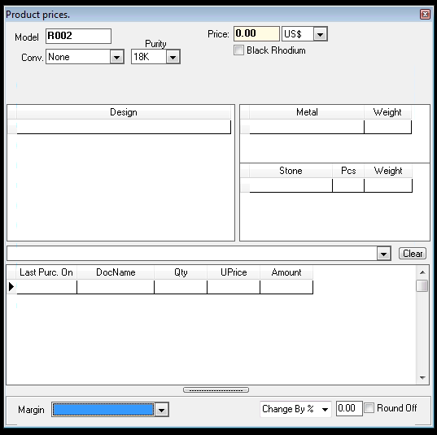

It allow you to search through the `Product` by entering the `Model` name and selecting the `Design`.

By clicking on `Analysis` one more drop-down menue appeared.
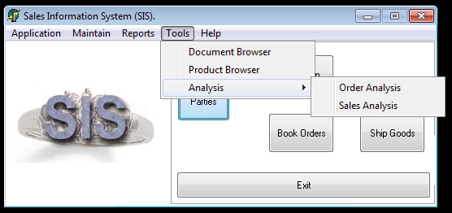

But by clicking on any of those two options `Order Analysis` and `Sales Analysis`, nothing happen.

### Lobby Help

On the toolbar, if you click on `Help` a drop-down menue appeared.
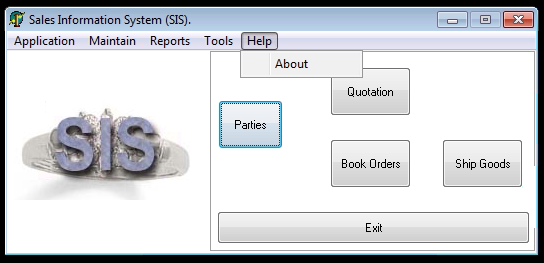

The button `About` will open.
This is useless.

